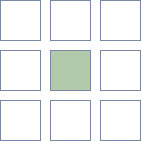
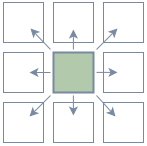
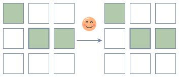
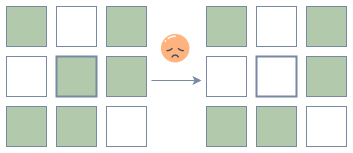
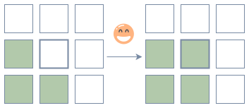
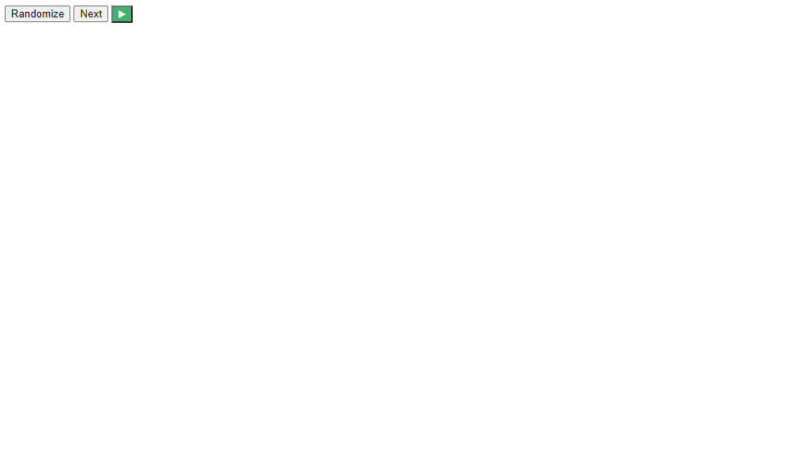
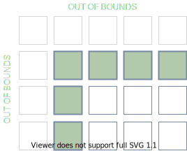

# Conway's Game of Life


This is Conway's Game of Life!

Inspired by one of the exercises in Chapter 18 of Eloquent Javascript, where the reader must implement the Game of Life by displaying a grid of checkbox fields on a webpage, with a button next to it to advance to the next generation.

## What is the Game of Life?

[Conway's Game of Life](https://en.wikipedia.org/wiki/Conway%27s_Game_of_Life) (or simply Life) is a cellular automaton created by John Conway, a smart dude who taught Finite Mathematics at Princeton. It's a zero-player game, which means that you can set the initial configuration and watch how it evolves over time—the game doesn't need any further user input.

Life is played on a 2D grid of square *cells*, each of which can be either "alive" or "dead". An alive cell is shown by putting a marker on its square, like this:



Each cell has eight neighbours, which are the cells that are found horizontal, vertical, or diagonal to the cell:



## The Rules

At each step a new generation is created by counting the number of neighbors each cell has and applying the rules to every cell simulataneously in the grid:

1. Any **alive** cell with two or three alive neighbors survives. <br>
2. Any **alive** cell with less than two or more than three alive neighbors dies (as if by isolation or overpopulation). <br>
3. Any **dead** cell with three alive neighbors becomes an alive cell. <br>

> :warning: The number of alive neighbors is always based on the cells *before* the rule was applied.

The end result looks like this:



## Run the Game of Life

To run the Game of Life locally on your machine, fork or clone this repository and run the following `bash` commands in the root folder:

```bash
npm install
ws
```

Open a new tab and run the following in the root folder:
```bash
cd ./canvas/
npx webpack --mode production
bopen http://127.0.0.1:8000/canvas/dist/
```

## How it Works

### `Grid`

The `Grid` class is a general class that handles creating a 2D grid of cells (points) starting from `(0, 0)`. A grid can have any positive integer height or width, e.g. `44x86` or even `0x0`, but does not contain negative coordinates, e.g. `(-4, 2)`, `(-4, -2)`, `(4, -2)`.

Each cell (point) in the grid has an `x` and `y` coordinate, and can hold a value of any type. For the Game of Life, every cell holds a value that corresponds to either "alive" or "dead".

### `Point`

The `Point` class is a general class that helps to work with a grid in terms of `x` and `y` coordinates. Given a point `(x, y)`, `point.neighbors` will return an array of points of the surrounding neighbors.

### `GridIterator`

The `GridIterator` class provides an interface to loop over each cell in a grid row by row using the point coordinates. This makes it easier to locate an individual cell in the grid and get or set its value. A grid can be looped over in a few different ways:

```js
grid.ForEach(point => foo(point));

for (let point of grid) {
  bar(point.x);
  baz(point.y)
}
```

A point can also be represented as {x, y}, e.g.

```js
for (let {x, y} of grid) {
 if (x % 3 == 0 && y % 5 == 0) fizzBuzz();
}
```
### `game-logic.js`

In `game-logic.js` the rules for Life are defined using functions that can:

- get if a cell is alive (`isAlive`);
- count how many alive neighbors a cell has (`numAliveNeighbors`); and
- set if a cell is alive (`setIsAlive`).

Together these functions help to determine if each cell should live on to the next generation (`willPointLive`). Calling `nextState` returns a new grid with the new generation of cells. This is also where the `randomize` function is, which can be used to randomize the state of the cells in a grid.

When counting the alive neighbors of a cell, `numAliveNeighbors` will first check that the coordinates of the neighbor cell are within the bounds of the grid before checking if the neighbor cell is alive, e.g. for cells located on the edges and corners of the grid.



### `index.js`

`index.js` uses `Grid` and `game-logic.js` to display the grid on a canvas in a webpage. It also adds some nice extra functionality for the user, like being able to randomize the grid, and seeing the next generation step-by-step or letting the game run automatically.